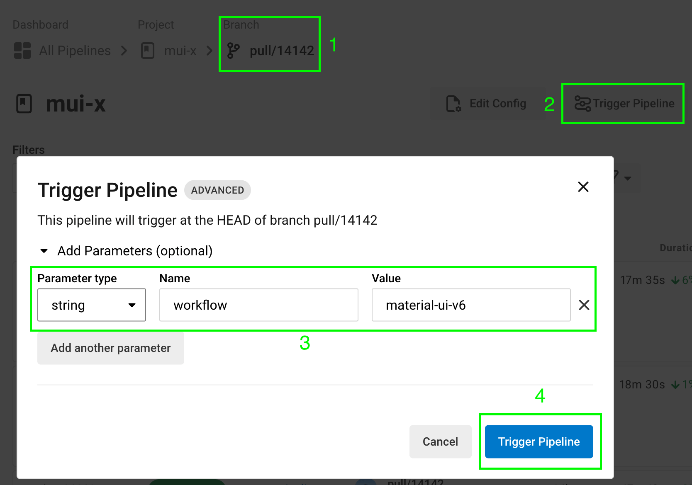

# Testing

## Testing multiple versions of React

You can check integration of different versions of React (for example different [release channels](https://react.dev/community/versioning-policy) or PRs to React) by running the following command:

`pnpm use-react-version <version>`

Possible values for `version`:

- default: `stable` (minimum supported React version)
- a tag on npm, for example `next`, `experimental` or `latest`
- an older version, for example `^17.0.0`

### CI

#### `next` version

For `react@next` specifically, there's a `react-next` workflow in our CircleCI pipeline that you can trigger in CircleCI on the PR you want to test:

1. Go to https://app.circleci.com/pipelines/github/mui/mui-x?branch=pull/PR_NUMBER and replace `PR_NUMBER` with the PR number you want to test.
2. Click `Trigger Pipeline` button.
3. Expand `Add parameters (optional)` and add the following parameter:

   | Parameter type | Name       | Value        |
   | :------------- | :--------- | :----------- |
   | `string`       | `workflow` | `react-next` |

4. Click `Trigger Pipeline` button.

#### Other versions

You can pass the same `version` to our CircleCI pipeline as well:

With the following API request we're triggering a run of the default workflow in
PR #24289 for `react@next`

```bash
curl --request POST \
  --url https://circleci.com/api/v2/project/gh/mui/mui-x/pipeline \
  --header 'content-type: application/json' \
  --header 'Circle-Token: $CIRCLE_TOKEN' \
  --data-raw '{"branch":"pull/24289/head","parameters":{"react-version":"next"}}'
```

## Testing multiple versions of Material UI

Currently, we use `@mui/material` v5 in the MUI X repo and all tests are run against it.
But MUI X packages are compatible with v5 and v6.
You can run the tests against `@mui/material` v6 by running the following command:

`pnpm use-material-ui-v6`

### CI

There's a `material-ui-v6` workflow in our CircleCI pipeline that you can trigger in CircleCI on the PR you want to test:

1. Go to https://app.circleci.com/pipelines/github/mui/mui-x?branch=pull/PR_NUMBER and replace `PR_NUMBER` with the PR number you want to test.
2. Click `Trigger Pipeline` button.
3. Expand `Add parameters (optional)` and add the following parameter:

   | Parameter type | Name       | Value            |
   | :------------- | :--------- | :--------------- |
   | `string`       | `workflow` | `material-ui-v6` |

4. Click `Trigger Pipeline` button.


