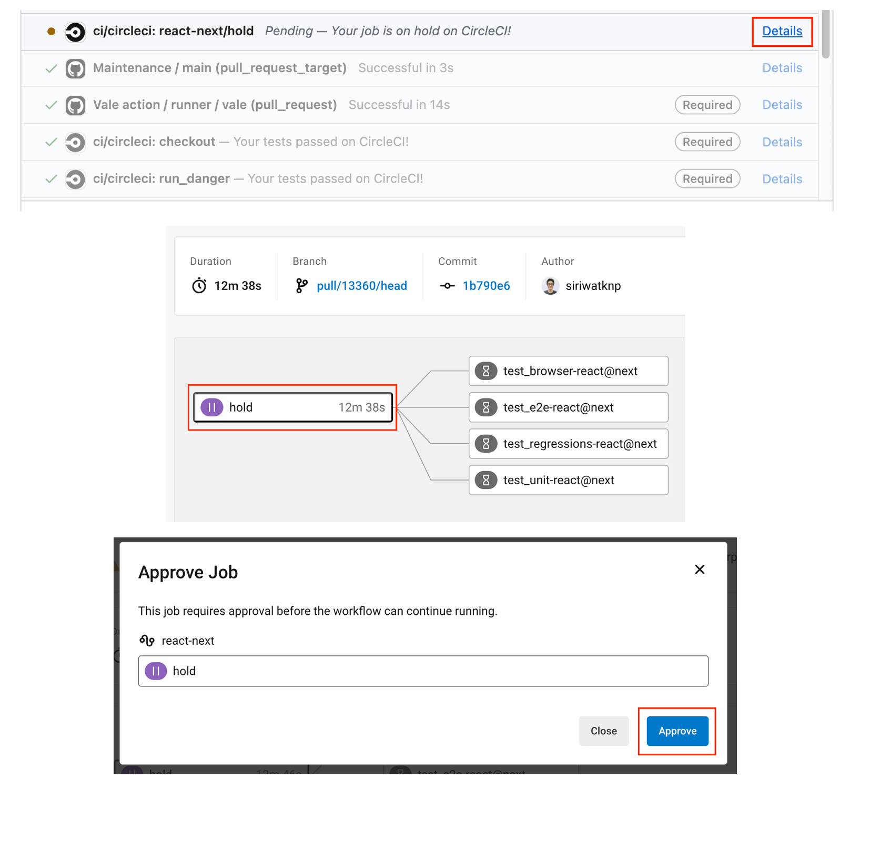

# Testing

## Testing multiple versions of React

You can check integration of different versions of React (for example different [release channels](https://react.dev/community/versioning-policy) or PRs to React) by running the following commands:

1. `node scripts/useReactVersion.mjs <version>`.

   Possible values for `version`:

   - default: `stable` (minimum supported React version)
   - a tag on npm, for example `next`, `experimental` or `latest`
   - an older version, for example `^17.0.0`

2. `pnpm install`

### CI

#### `next` version

For `react@next` specifically, there's a `react-next` workflow in our CircleCI pipeline that is always on hold and needs a manual approval to run:



#### Other versions

You can pass the same `version` to our CircleCI pipeline as well:

With the following API request we're triggering a run of the default workflow in
PR #24289 for `react@next`

```bash
curl --request POST \
  --url https://circleci.com/api/v2/project/gh/mui/mui-x/pipeline \
  --header 'content-type: application/json' \
  --header 'Circle-Token: $CIRCLE_TOKEN' \
  --data-raw '{"branch":"pull/24289/head","parameters":{"react-version":"next"}}'
```
