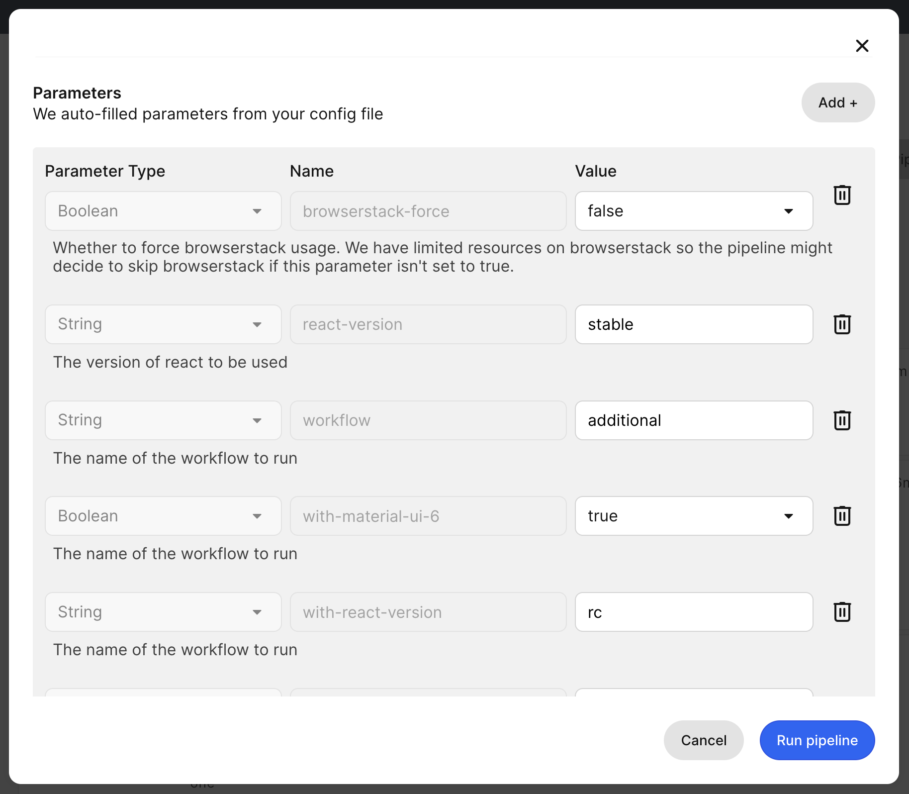

# Testing

## Testing multiple versions of React

You can check integration of different versions of React (for example different [release channels](https://react.dev/community/versioning-policy) or PRs to React) by running the following command:

`pnpm use-react-version <version>`

Possible values for `version`:

- default: `stable` (minimum supported React version)
- a tag on npm, for example `next`, `experimental` or `latest`
- an older version, for example `^17.0.0`

## Testing multiple versions of Material UI

Currently, we use `@mui/material` v5 in the MUI X repo and all tests are run against it.
But MUI X packages are compatible with v5 and v6.
You can run the tests against `@mui/material` v6 by running the following command:

`pnpm use-material-ui-v6`

## CI

To execute additional jobs for custom versions of React/Material UI, you can use an `additional` workflow. In combination with `with-react-version` and/or `with-material-ui-6` parameters, it executes those jobs with dependency versions different from the main `pipeline` workflow.

| Parameter type | Name                 | Value                |
| :------------- | :------------------- | :------------------- |
| `string`       | `workflow`           | `additional`         |
| `string`       | `with-react-version` | `<VERSION_OF_REACT>` |
| `boolean`      | `with-material-ui-6` | `true` or `false`    |

1. Go to https://app.circleci.com/pipelines/github/mui/mui-x?branch=pull/PR_NUMBER and replace `PR_NUMBER` with the PR number you want to test.
2. Click `Trigger Pipeline` button.
3. Go to the `Parameters` section and update the `workflow` parameter in combination with the version parameter(s).
   You can leave the rest of the parameters with their default values.
4. Click `Trigger Pipeline` button.



### API

You can pass the same to our CircleCI pipeline through API as well:

With the following API request we're triggering a run of the `additional` workflow in
PR #24289 for `react@rc` and `@mui/material-ui@6`

```bash
curl --request POST \
  --url https://circleci.com/api/v2/project/gh/mui/mui-x/pipeline \
  --header 'content-type: application/json' \
  --header 'Circle-Token: $CIRCLE_TOKEN' \
  --data-raw '{"branch":"pull/24289/head","parameters":{"workflow":"additional","with-react-version":"rc","with-material-ui-6":true}}'
```
